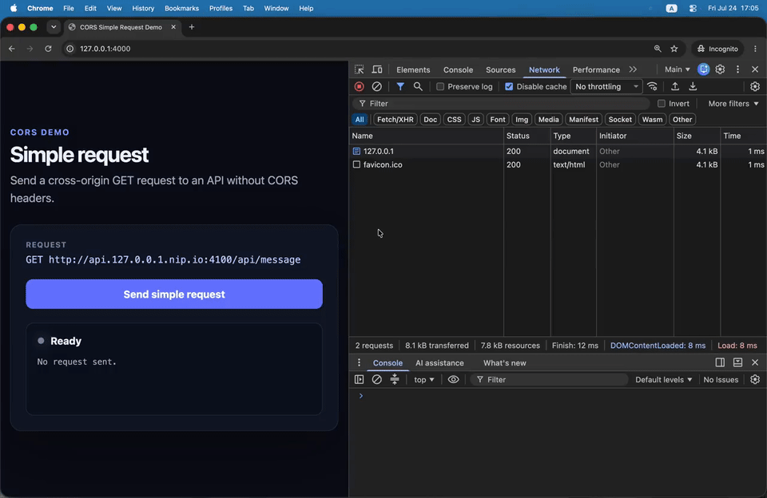
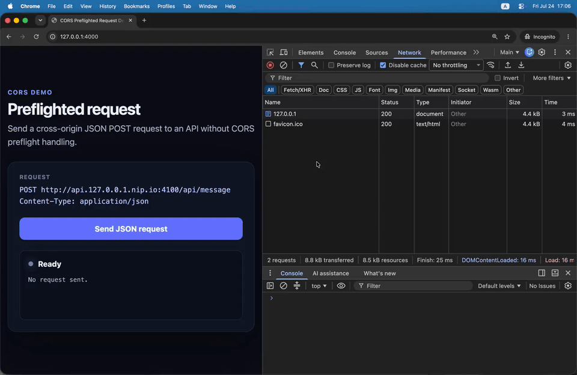

# seamless-cors

English | [繁體中文](README.zh-TW.md)

`seamless-cors` is a local development and QA tool for testing browser requests
across origins without changing application URLs or adding CORS support to the
upstream server.

It uses a Proxy Auto-Configuration (PAC) file to route only the domains you
choose through the local gateway. HTTP works directly, with HTTPS support as an
opt-in feature.

> [!NOTE]
> This project is under active development.

> [!WARNING]
> seamless-cors is intended only for local development and QA environments.

## Demos

### Simple request

A cross-origin `GET` that the browser sends directly to an API without CORS
response headers.



### Preflighted request

A JSON `POST` that first causes the browser to send an `OPTIONS` preflight
request.



## Installation

### npm

With Node.js 18 or later installed:

```sh
npm install --global seamless-cors
```

npm installs only the Gateway Distribution matching the current operating
system and processor.

Verify the installation:

```sh
seamless-cors version
```

### Go install

With Go 1.23.1 or later installed, build and install the latest release:

```sh
go install github.com/QzCurious/seamless-cors/cmd/seamless-cors@latest
```

Ensure the Go binary directory (`$(go env GOPATH)/bin`) is on your `PATH`.

### Prebuilt release

Download the archive for your platform and processor from the
[latest GitHub release](https://github.com/QzCurious/seamless-cors/releases/latest),
then extract it.

#### macOS

After extracting the archive in `~/Downloads`, install the binary:

```sh
mkdir -p ~/.local/bin
mv ~/Downloads/seamless-cors ~/.local/bin/seamless-cors
# Allow this trusted Release binary to run on macOS
xattr -d com.apple.quarantine ~/.local/bin/seamless-cors
```

Ensure `~/.local/bin` is on the `PATH` for the shell you use.

#### Windows

Move `seamless-cors.exe` from the extracted archive to a directory you own,
such as `%USERPROFILE%\.local\bin`. Add that directory to your user `Path` in
Windows Environment Variables, then open a new terminal.

Windows may show a SmartScreen warning for an unsigned release. If you trust
the download came from this project's GitHub Release, select **More info** and
then **Run anyway**. A managed work device may not permit this exception.

## Quick Start

```sh
seamless-cors start
```

On first start, seamless-cors creates `~/.seamless-cors/config.yaml` and
`~/.seamless-cors/domains.txt`.

Add the upstream hostnames or origins for which you want to enable CORS, one per
line, to `~/.seamless-cors/domains.txt`:

```text
api.dev.example.com
https://api.example.com:8443
*.test.example.com
```

The domain list is watched for changes while the gateway is running.

To enable HTTPS interception, set `ca-trusted: true` in `config.yaml` and
restart the gateway. Your operating system will ask you to approve installing
the seamless-cors development CA.

When you are finished, press `Ctrl+C` to stop the gateway and remove its PAC
settings.

## Platform support

The managed platform integrations currently target macOS and Windows.

## License

[MIT](LICENSE)
