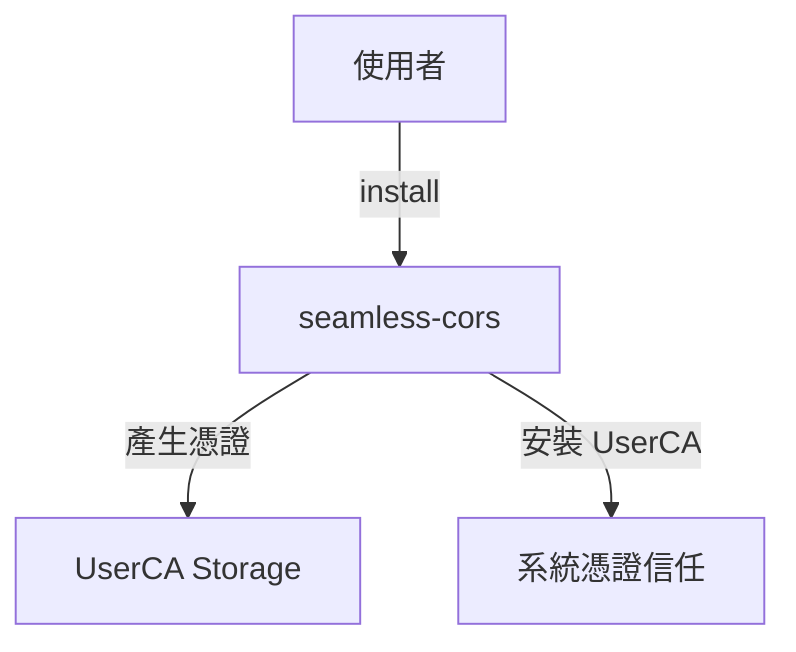
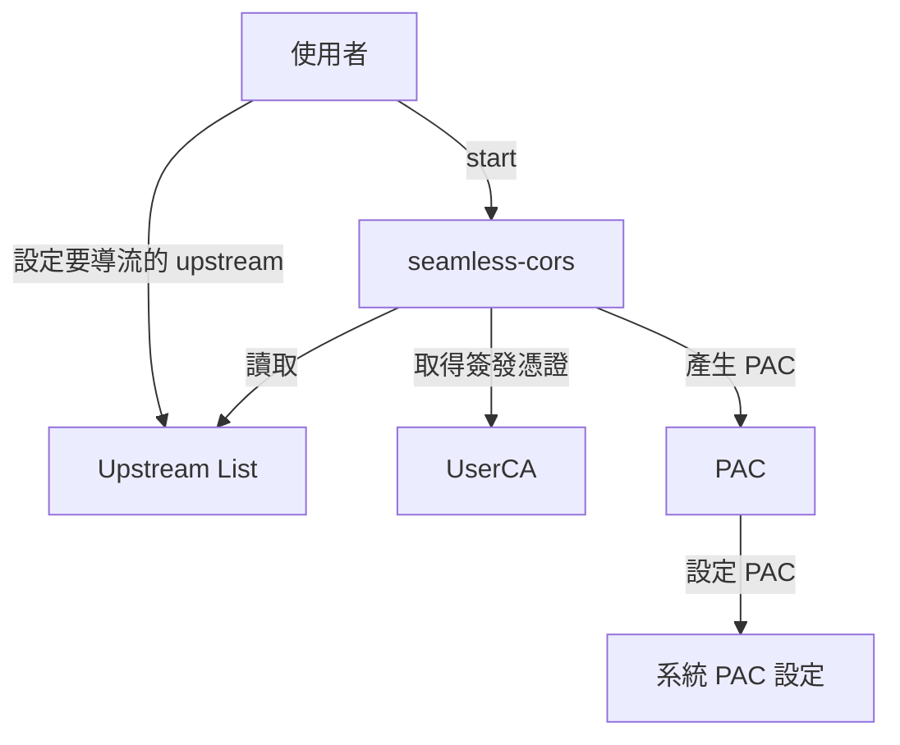
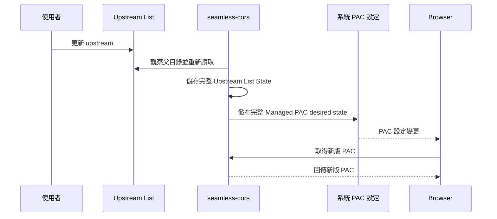
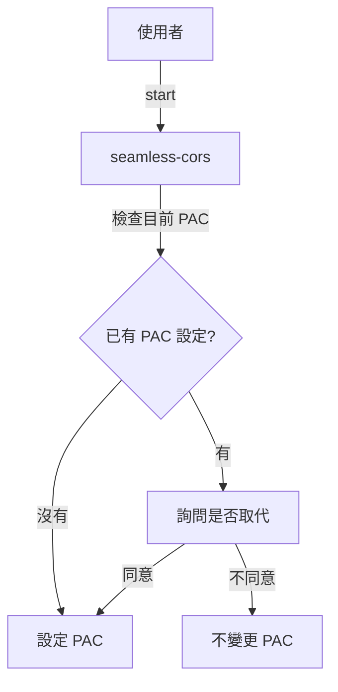
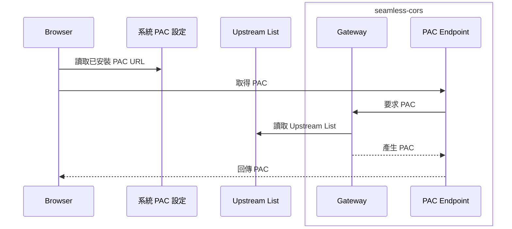
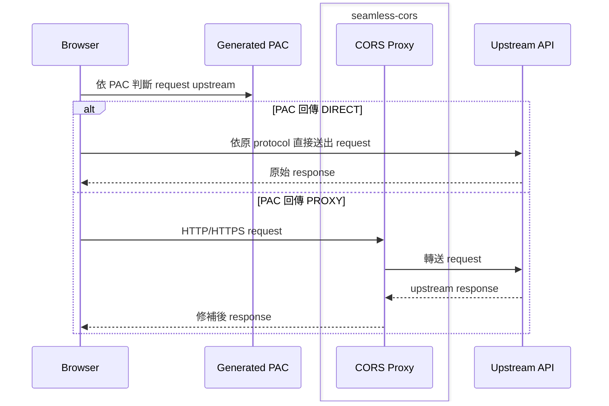
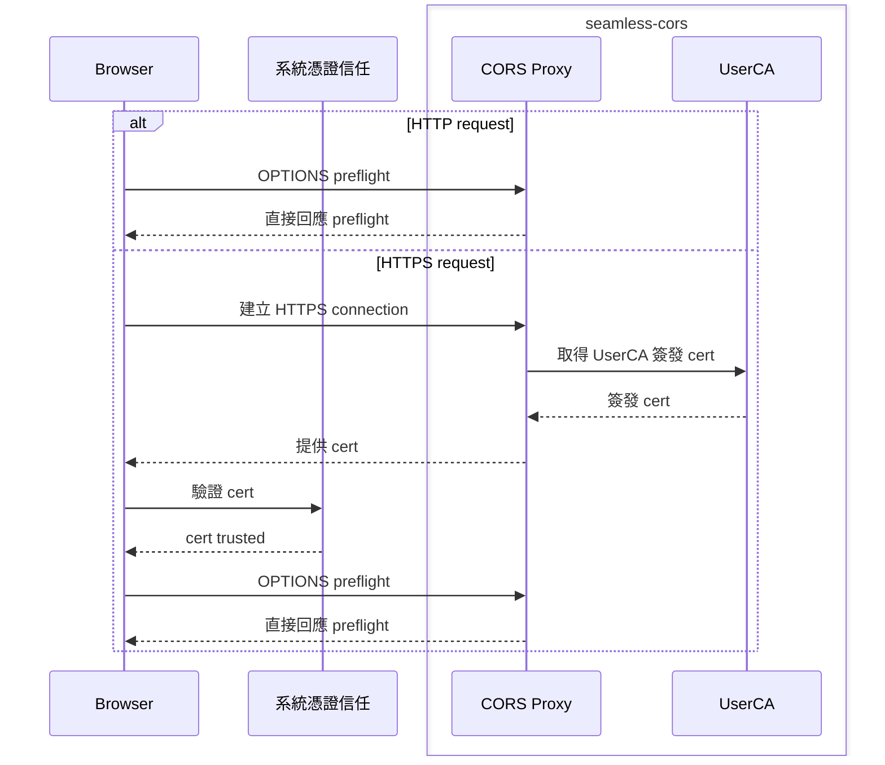
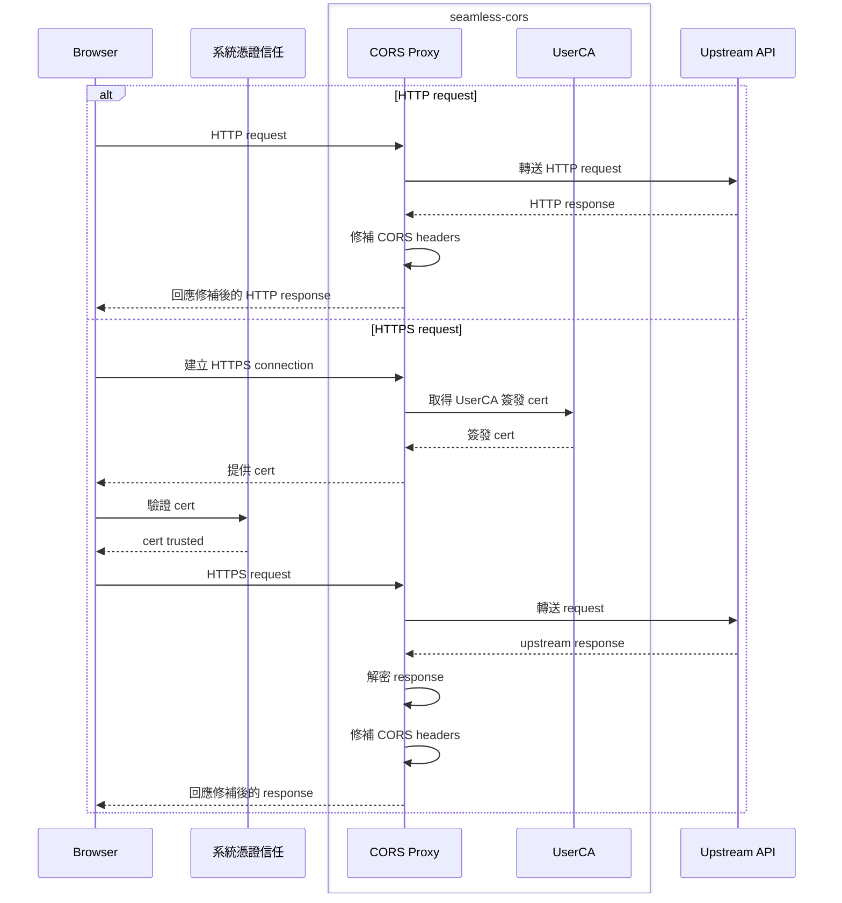

## CA Setup

```mermaid
flowchart TD
  User[使用者]
  SeamlessCors[seamless-cors]
  CAStorage[UserCA Storage]
  SystemTrust[系統憑證信任]

  User -->|install| SeamlessCors
  SeamlessCors -->|產生憑證| CAStorage
  SeamlessCors -->|安裝 UserCA| SystemTrust
```

## Gateway Setup

```mermaid
flowchart TD
  User[使用者]
  SeamlessCors[seamless-cors]
  UpstreamList[Upstream List]
  UserCA[UserCA]
  PAC[PAC]
  SystemPAC[系統 PAC 設定]

  User -->|設定要導流的 upstream| UpstreamList
  User -->|start| SeamlessCors
  SeamlessCors -->|讀取| UpstreamList
  SeamlessCors -->|取得簽發憑證| UserCA
  SeamlessCors -->|產生 PAC| PAC
  PAC -->|設定 PAC| SystemPAC
```

## Upstream List Source and Managed PAC Flow

```mermaid
sequenceDiagram
  participant User as 使用者
  participant UpstreamList as Upstream List
  participant SeamlessCors as seamless-cors
  participant SystemPAC as 系統 PAC 設定
  participant Browser

  User->>UpstreamList: 更新 upstream
	SeamlessCors->>UpstreamList: 觀察父目錄並重新讀取
	SeamlessCors->>SeamlessCors: 儲存完整 Upstream List State
	SeamlessCors->>SystemPAC: 發布完整 Managed PAC desired state
	SystemPAC-->>Browser: PAC 設定變更
  Browser->>SeamlessCors: 取得新版 PAC
  SeamlessCors-->>Browser: 回傳新版 PAC
```

## PAC 設定確認

```mermaid
flowchart TD
  User[使用者]
  SeamlessCors[seamless-cors]
  CurrentPAC{已有 PAC 設定?}
  Ask[詢問是否取代]
  SetPAC[設定 PAC]
  NoChange[不變更 PAC]

  User -->|start| SeamlessCors
  SeamlessCors -->|檢查目前 PAC| CurrentPAC
  CurrentPAC -->|沒有| SetPAC
  CurrentPAC -->|有| Ask
  Ask -->|同意| SetPAC
  Ask -->|不同意| NoChange
```

## PAC Flow

```mermaid
sequenceDiagram
  participant Browser
  participant SystemPAC as 系統 PAC 設定
  participant UpstreamList as Upstream List
  box seamless-cors
    participant Gateway
    participant PacEndpoint as PAC Endpoint
  end

  Browser->>SystemPAC: 讀取已安裝 PAC URL
  Browser->>PacEndpoint: 取得 PAC
  PacEndpoint->>Gateway: 要求 PAC
  Gateway->>UpstreamList: 讀取 Upstream List
  Gateway-->>PacEndpoint: 產生 PAC
  PacEndpoint-->>Browser: 回傳 PAC
```

## PAC Routing Flow

```mermaid
sequenceDiagram
  participant Browser
  participant GeneratedPAC as Generated PAC
  box seamless-cors
    participant CorsProxy as CORS Proxy
  end
  participant Upstream as Upstream API

  Browser->>GeneratedPAC: 依 PAC 判斷 request upstream
  alt PAC 回傳 DIRECT
    Browser->>Upstream: 依原 protocol 直接送出 request
    Upstream-->>Browser: 原始 response
  else PAC 回傳 PROXY
    Browser->>CorsProxy: HTTP/HTTPS request
    CorsProxy->>Upstream: 轉送 request
    Upstream-->>CorsProxy: upstream response
    CorsProxy-->>Browser: 修補後 response
  end
```

## Preflight Flow

```mermaid
sequenceDiagram
  participant Browser
  participant SystemTrust as 系統憑證信任
  box seamless-cors
    participant CorsProxy as CORS Proxy
    participant UserCA
  end

  alt HTTP request
    Browser->>CorsProxy: OPTIONS preflight
    CorsProxy-->>Browser: 直接回應 preflight
  else HTTPS request
    Browser->>CorsProxy: 建立 HTTPS connection
    CorsProxy->>UserCA: 取得 UserCA 簽發 cert
    UserCA-->>CorsProxy: 簽發 cert
    CorsProxy-->>Browser: 提供 cert
    Browser->>SystemTrust: 驗證 cert
    SystemTrust-->>Browser: cert trusted
    Browser->>CorsProxy: OPTIONS preflight
    CorsProxy-->>Browser: 直接回應 preflight
  end
```

## Request Flow

```mermaid
sequenceDiagram
  participant Browser
  participant SystemTrust as 系統憑證信任
  box seamless-cors
    participant CorsProxy as CORS Proxy
    participant UserCA
  end
  participant Upstream as Upstream API

  alt HTTP request
    Browser->>CorsProxy: HTTP request
    CorsProxy->>Upstream: 轉送 HTTP request
    Upstream-->>CorsProxy: HTTP response
    CorsProxy->>CorsProxy: 修補 CORS headers
    CorsProxy-->>Browser: 回應修補後的 HTTP response
  else HTTPS request
    Browser->>CorsProxy: 建立 HTTPS connection
    CorsProxy->>UserCA: 取得 UserCA 簽發 cert
    UserCA-->>CorsProxy: 簽發 cert
    CorsProxy-->>Browser: 提供 cert
    Browser->>SystemTrust: 驗證 cert
    SystemTrust-->>Browser: cert trusted

    Browser->>CorsProxy: HTTPS request
    CorsProxy->>Upstream: 轉送 request
    Upstream-->>CorsProxy: upstream response
    CorsProxy->>CorsProxy: 解密 response
    CorsProxy->>CorsProxy: 修補 CORS headers
    CorsProxy-->>Browser: 回應修補後的 response
  end
```
